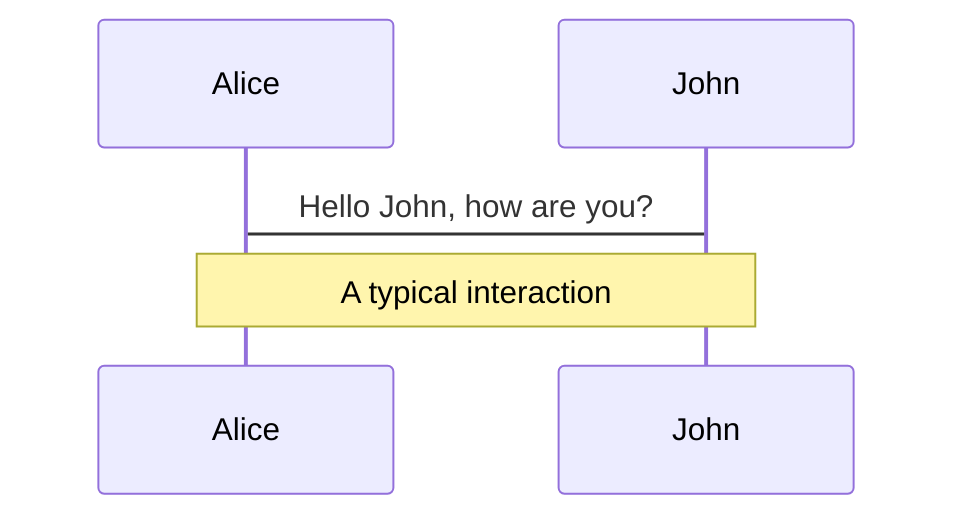
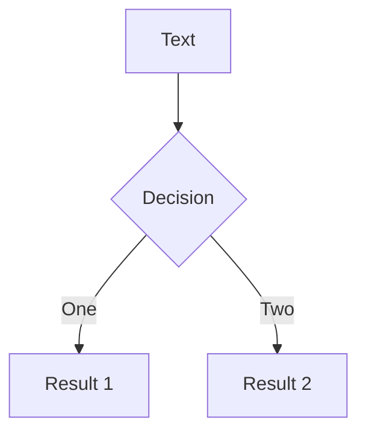
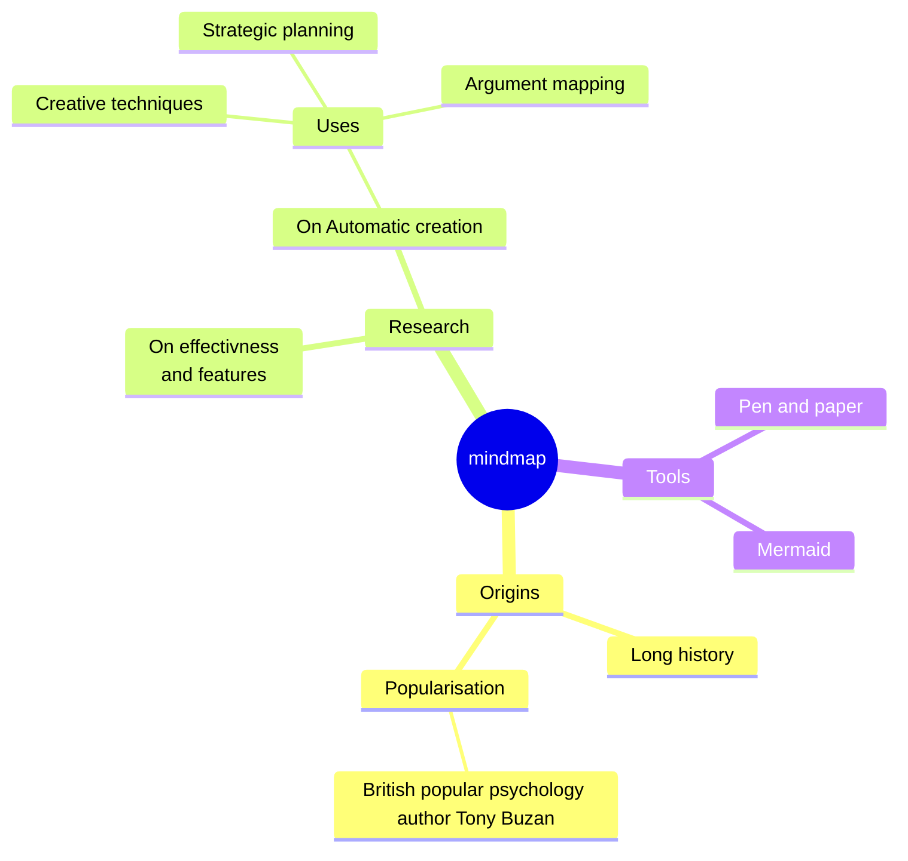

# Gestion de versions et outils de build


<div class="pt-12">
  <span @click="$slidev.nav.next" class="px-2 py-1 rounded cursor-pointer" hover="bg-white bg-opacity-10">
    Press Space for next page <carbon:arrow-right class="inline"/>
  </span>
</div>

<div class="abs-br m-6 flex gap-2">
  <button @click="$slidev.nav.openInEditor()" title="Open in Editor" class="text-xl slidev-icon-btn opacity-50 !border-none !hover:text-white">
    <carbon:edit />
  </button>
  <a href="https://github.com/slidevjs/slidev" target="_blank" alt="GitHub" title="Open in GitHub"
    class="text-xl slidev-icon-btn opacity-50 !border-none !hover:text-white">
    <carbon-logo-github />
  </a>
</div>

<!--
The last comment block of each slide will be treated as slide notes. It will be visible and editable in Presenter Mode along with the slide. [Read more in the docs](https://sli.dev/guide/syntax.html#notes)
-->

---
transition: fade-out
---

# Why

Apply patterns to project build infrastructure to provide a coherent view of software projects.

Provides a way to help with managing:

- **Builds**
- **Dependencies**
- **Software Configuration Management**
- Documentation
- Reporting
- Releases

---
layout: default
---

# Objectives


- Make the development process visible or transparent
- Provide an easy way to see the health and status of a project
- Decreasing training time for new developers
- Bringing together the tools required in a uniform way
- Preventing inconsistent setups
- Providing a standard development infrastructure across projects
- Focus energy on writing applications


---
layout: default
---

# Benefits


- Standardization 
- Fast and easy to set up a powerful build process
- Dependency management (automatic downloads)
- Project website generation, Javadoc 
- Repository management
- Extensible architecture

---
layout: center
class: text-center
---

# Un premier exemple avec Maven

Pour le côté historique

---
layout: default
---

# What is Maven?

- A build tool
- A dependency management tool
- A documentation tool

---
layout: default
---


# What is Maven?

<div>

</div>


---
layout: default
---

# Common project metadata format

- POM = Project Object Model = pom.xml
- Contains metadata about the project
- Location of directories, Developers/Contributors, Issue tracking system, Dependencies, Repositories to use, etc
- Example:

```xml
<project>
  <modelVersion>4.0.0</modelVersion>
  <groupId>org.codehaus.cargo</groupId>
  <artifactId>cargo-core-api-container</artifactId>
  <name>Cargo Core Container API</name>
  <version>0.7-SNAPSHOT</version>
  <packaging>jar</packaging>
  <dependencies/>
  <build/>
[…]
```


---
layout: default
---

# Standard directory organization

- Having a common directory layout would allow for users familiar with one Maven project to immediately feel at home in another Maven project.


<div grid="~ cols-2 gap-2" m="-t-2">


</div>

<v-click>

<div class="absolute left-80px top-270px">
<Transform :scale="0.7">
<svg width="800" height="600" xmlns="http://www.w3.org/2000/svg">

 <g>
  <title>Layer 1</title>
  <path stroke="#000" id="svg_1" d="m397.00001,349.81252l-181.52499,0l0,-105.5l27.82499,0l-55.64999,-52.74999l-55.65001,52.74999l27.82501,0l0,158.25l237.17499,0l0.00001,-52.75001z" fill="#fff"/>
  <text stroke="#000" xml:space="preserve" text-anchor="start" font-family="Noto Sans JP" font-size="7" stroke-width="0" id="svg_2" y="384.5" x="422" fill="#FF0000">Convention over configuration</text>
 </g>

</svg>
</Transform></div>
</v-click>

---
layout: default
---


# Common way to build applications

<Transform :scale="0.9">
<div class="">

</div>
</Transform>

---
layout: default
---

# Artifact repositories (1/3)

<div class="absolute left-100px bottom-20px">

</div>


- Used to store all kind of artifacts
  - JARs, EARs, WARs, NBMs, EJBs, ZIPs, plugins, …
- All project interactions go through the repository
  - No more relative paths!
  - Easy to share between team

```xml
<repositories>
  <repository>
    <id>maven2-snapshot</id>
    <releases>
      <enabled>true</enabled>
    </releases>
    <name>Maven Central Development Repository</name>
    <url>http://snapshots.maven.codehaus.org/maven2</url>
    <layout>legacy|default</layout>
  </repository>
</repositories>
```

---
layout: default
---

# Artifact 0repositories (2/3)

Some public remote repositories

<div class="absolute left-100px bottom-0px">

</div>


---
layout: two-cols
---

# Artifact repositories (3/3)

- Hierarchical structure
- Automatic plugin download
- Plugins are read directly from the repository
- Configurable strategies for checking the remote repositories for updates
  - Daily check by default for plugin and ranges updates
- Remote repositories contain Metadata information
  - Releases, latest, and more to come

::right::
<div class="absolute left-10px top-50px">

</div>

<arrow x1="00" y1="320" x2="100" y2="330" color="#564" width="2" arrowSize="1" />


---
layout: two-cols
---

# Dependency management

- Maven uses binary dependencies

<div class="absolute left-50px top-120px">

</div>

::right::

<div style="height:50px;"></div>

```xml
<dependencies>
  <dependency>
    <groupId>com.acme</groupId>
    <artifactId>B</artifactId>
    <version>[1.0,)</version>
    <scope>compile</scope>
  </dependency>
</dependencies>
```

<div class="absolute left-150px bottom-330px">

</div>


<Transform :scale="1.6">
<div class="absolute right-150px top-30px">

</div>
</Transform>


---
layout: two-cols
---

# Dependency management


- Transitive dependencies
  - Possibility to exclude some depndencies
  - Need good metadata
  - Ideally projects should be split
- SNAPSHOT handling
  - Always get latest
- Automatic dependency updates
  - By default every day

::right::

<div style="height:50px;"></div>

<Transform :scale="1.2">
<div class="absolute right-100px top-30px">

</div>
</Transform>

---
layout: default
---

# Installation and Setup

- Download Maven 3 from http://maven.apache.org/
- Add Maven’s bin directory to PATH
- Ensure JAVA_HOME is set to SDK
- Run mvn --version to test install

```bash
$ mvn --version
Apache Maven 3.8.7
Maven home: /usr/share/maven
Java version: 17.0.8.1, vendor: Private Build, runtime: /usr/lib/jvm/java-17-openjdk-amd64
Default locale: fr_FR, platform encoding: UTF-8
OS name: "linux", version: "6.2.0-060200-generic", arch: "amd64", family: "unix"
```


---
layout: default
---

# Overview of common Goals


- **clean** – clean the current project
- **validate** - validate the project is correct and all necessary information is available 
- **compile** - compile the source code of the project 
- **test** - test the compiled source code using a suitable unit testing framework. These tests should not require the code be packaged or deployed 
- **package** - take the compiled code and package it in its distributable format, such as a JAR
- **integration-test** - process and deploy the package if necessary into an environment where integration  tests can be run 
- **install** - install the package into the local repository, for use as a dependency in other projects locally 
- **deploy** - done in an integration or release environment, copies the final package to the remote repository for sharing with other developers and projects


---
layout: default
---

# Creating project website

```bash
mvn site
```

- Let the build run, it’ll start downloading and creating things left and right
- Eventually in the target dir you end up with a site dir, with an apache-style project website
- Javadoc, various reports, and custom content can be added


---
layout: default
---

# More stuff

- Automatically generate reports, diagrams, and so on through Maven / the project site
- Internationalization – create different language project websites
- Create projects within projects (more pom.xml files inside sub dirs\jars), with different build stats and so on
- Maven can make .war files, EJBs, etc.

---
layout: default
---

# Using Maven Plugins

- Whenever you want to customise the build for a Maven project, this is done by adding or reconfiguring plugins
- For example, configure the Java compiler to allow JDK 5.0 sources 

```xml
...
<build>
  <plugins>
    <plugin>
      <groupId>org.apache.maven.plugins</groupId>
      <artifactId>maven-compiler-plugin</artifactId>
      <configuration>
        <source>1.5</source>
        <target>1.5</target>
      </configuration>
    </plugin>
  </plugins>
</build>
...
```

---
layout: two-cols-header
---

# Maven Plugins

::left::


- AlmostPlainText
- Maven Cobertura
- Dbunit
- Debian Package
- Maven DotUml
- Doxygen
- FindBugs
- Maven flash
- Maven IzPack
- Java Application
- Kodo
- Maven Macker
- SDocBook
- Maven SpringGraph

::right::


- Strutsdoc
- Tasks 
- Maven Transform
- Maven Vignette
- WebSphere 4.0 
- WebSphere 5 (5.0/5.1)
- Maven WebLogic
- Canoo WebTest 
- Wiki
- XML Resume
- Maven DotUml
- Middlegen
- Maven News
- ...


---
layout: default
---

# Archetypes

- For reuse, create archetypes that work as project templates with build settings, etc
- An archetype is a project, with its own pom.xml
- An archetype has a descriptor called archetype.xml
- Allows easy generation of Maven projects

---
layout: two-cols-header
---

# Good things about Maven

::left::

- Standardization
- Reuse
- Dependency management
- Build lifecycle management
- Large existing repository
- IDE aware
- One directory layout
- A single way to define dependencies
- Setting up a project is really fast
- Transitive dependencies
- Common build structure
- Use of remote repository
- Web site generation

::right::

- Build best practices enforcement
- Automated build of application 
- Works well with distributed teams 
- All artifacts are versioned and are stored in a repository
- Build process is standardized for all projects
- A lot of goals are available 
- It provides quality project information with generated site
- Easy to learn and use
- Makes the build process much easier at the project level 
- Promotes modular design of code

---
layout: default
---

# References

- [Maven Home](http://maven.apache.org/)
- [Maven Getting Started Guide](http://maven.apache.org/guides/getting-started/index.html)
- [Maven Integration for Eclipse](http://m2eclipse.codehaus.org/)

---
layout: center
class: text-center
---


# L'écosystème JS

---
layout: center
class: text-center
---

## Project Tools
No matter the Editor

---
layout: default
---

# Project Tools

- NPM, Yarn & Bower
  - Install Node.js packages or client libraries
- Grunt & Gulp
  - Tasks runner
  - Create different tasks for build/development/test cases
- Yeoman
  - Scaffolding of applications
  - One-line-of-code to create a project template with views/routes/modules/etc…

---
layout: center
class: text-center
---

# Package Management

NPM, Yarn & Bower

---
layout: default
---

# Package Management: NPM

- Node.js Package Management (NPM)
- Package manager for Node.js modules
```bash
npm init #in CMD (Win) or Terminal (MAC/Linux)
```
- Initializes an empty Node.js project with package.json file

```bash
 npm init
//enter package details
name: "NPM demos"
version: 0.0.1
description: "Demos for the NPM package management"
entry point: main.js
test command: test
git repository: http://github.com/user/repository-name
keywords: npm, package management
author: doncho.minkov@telerik.com
license: BSD-2-Clause
```

---
layout: default
---

# Package Management: NPM

<div align="left"> - Installing modules</div>

```bash
npm install package-name [--save][--save-dev][--save-optional]
# Installs a package to the Node.js project
```

- *-S*, *--save*: Package will appear in your dependencies in package.json
- *-D*, *--save-dev*: Package will appear in your devDependencies
- *-O*, *--save-optional*: Package will appear in your optionalDependencies.

```bash
npm install express --save-dev
```
 Before running the project
```bash
npm install ## Installs all missing packages from package.json
```

---
layout: default
---

# Package Management: Bower (Deprecated)

- Bower is a package management tool for installing client-side JavaScript libraries
  - Like jQuery, KendoUI, AngularJS, etc…
  - It is a Node.js package and should be installed first
```bash
npm install –g bower
bower init # in CMD (Win) or Terminal (Mac/Linux)
```
- Asks for pretty much the same details as *$ npm init*
- Creates bower.json file to manage libraries

---
layout: default
---

# Package Management: Bower

- Searching for libraries
```bash
bower search kendo
```
<div align="center"></div>
- Installing libraries
```bash
bower install kendo-ui
```
<div align="center"></div>


---
layout: center
class: text-center
---

# Tasks Runner

Grunt & Gulp & NPM


---
layout: default
---

#  Tasks Runner

- Grunt/Gulp are Node.js task runners
  - They can run different tasks, based on configuration
  - Tasks can be:
    - Concat and minify JavaScript/CSS files
    - Compile SASS/LESS/Stylus
    - Run jshint, csshint
    - Run Unit Tests
    - Deploy to Git, Cloud, etc…
    - And many many more

---
layout: default
---

## Task Runner
- Why use a task runner?
  - Task runners gives us automation, even for different profiles:

<Transform :scale="0.95">

  **DEVELOPMENT**	| **TEST** | **BUILD**
  -- | -- | --
  jshint | jshint | jshint
  stylus | stylus | stylus
  csshint | csshint | csshint
  connect | mocha | concat
  watch | | uglify
  |   |  |  copy
  |  |  | usemin

</Transform>

---
layout: center
class: text-center
---

# Yeoman
Application Scaffolding

---
layout: default
---

# Yeoman

- Yeoman is a Node.js package for application scaffolding
  - Uses bower & NPM to install the js package
  - Has lots of generators for many types of applications:
    - MEAN, AngularJS, Kendo-UI, WebApp, WordPress, Backbone, Express, etc…
    - Each generators install both needed Node.js packages and client-side JavaScript libraries
    - Generated Gruntfile.js for build/test/serve


---
layout: default
---

# Yeoman
<pre>Install Yeoman:</pre>
```bash
npm install –g yo
```
<pre>Install Yeoman generator:</pre>
```bash
npm install –g generator-jhipster
```
<pre>Scaffold Express application:</pre>
```bash
cd path/to/app/directory
yo jhipster
```
<pre>Generates:</pre>
<div align="center"></div>


---
layout: center
class: text-center
---

# L'écosystème Python

---
layout: default
---

# L'écosystème Python


> Python est langage fantastique, mais il y a un point qui laisse à désirer par rapport aux environnements plus récents comme node ou rust : le gestionnaire de package. 

---
layout: default
---

# Pip

- Pour déclarer les dépendances d’une application python, 
    - requirements.txt listant tous les packages nécessaires avec leur version

```txt
redis==2.10.6
rq==0.13
```

- on peut mettre une version exacte (par exemple redis==2.10.6)
- ou des bornes pour définir une plage de versions acceptables, par exemple redis>=2.1.3,<3 accepte toutes les versions supérieures à la version 2.1.3 et inférieures à la version 3.0.0

> Il est cependant vivement recommandé d’utiliser des versions exactes pour éviter que les versions sélectionnées par Pip changent sans prévenir au cours du temps.

---
layout: default
---

# Pip

Pour l’installation, on utilise ensuite la commande :

```bash
pip install -r requirements.txt
```

---
layout: default
---

# Les problèmes

- L’isolation des applications
- Les jeux de dépendances multiples


---
layout: default
---

# L’isolation des applications

- Pip n’a pas de notion d’application ou de projet: 
   - si on utilise naïvement cette commande depuis deux applications, Pip va mixer les dépendances des deux applications et créer un système généralement inutilisable
- Pour isoler chaque application, besoin d'un autre outil: **virtualenv** ce qui va compliquer tout de suite la création de l’environnement de développement et l’installation de l’application en production

---
layout: default
---

# Les jeux de dépendances multiples

### Les mises à jour

- Comme toutes les versions des packages doivent être manuellement spécifiées dans les fichiers requirements, il est très facile de créer des incompatibilités et Pip, s’il détecte le problème, n’aide pas du tout à le résoudre. 

```txt
redis==2.10.6
rq==0.13
```
> Ces deux packages sont incompatibles car rq dépend de redis>=3.0.0. Voilà le comportement de Pip:


```bash
$ pip install -r requirements.txt
Collecting redis==2.10.6 (from -r requirements.txt (line 1))
  Using cached https://files.pythonhosted.org/packages/3b/f6/7a76333cf0b9251ecf49efff635015171843d9b977e4ffcf59f9c4428052/redis-2.10.6-py2.py3-none-any.whl
Collecting rq==1.0 (from -r requirements.txt (line 2))
  Using cached https://files.pythonhosted.org/packages/ee/f6/dbcf2a28e5621e1fcf6be6937da9777ad9ab03c7d3cb7d6ee835adc43329/rq-1.0-py2.py3-none-any.whl
Collecting click>=5.0 (from rq==1.0->-r requirements.txt (line 2))
  Using cached https://files.pythonhosted.org/packages/fa/37/45185cb5abbc30d7257104c434fe0b07e5a195a6847506c074527aa599ec/Click-7.0-py2.py3-none-any.whl
ERROR: rq 1.0 has requirement redis>=3.0.0, but you'll have redis 2.10.6 which is incompatible.
Installing collected packages: redis, click, rq
Successfully installed click-7.0 redis-2.10.6 rq-1.0
```

---
layout: default
---

# Les jeux de dépendances multiples

### Les mises à jour

Pip affiche bien un message d’erreur, mais le package rq est maintenant inutilisable et il va falloir trouver à la main, par essai-erreur, une combinaison de versions qui fonctionne.


> On se retrouve généralement dans cette situation en essayant de faire une mise à jour : on modifie la version d’un package et la nouvelle version introduit une incompatibilité. Ce problème rend les mises à jour de versions dans les fichiers requirements **pénibles** et **dangereuses**. 


<AutoFitText :max="50" :min="30" modelValue="Risque important pour la sécurité"/>


---
layout: default
---

# Les jeux de dépendances multiples

### Les packages résiduels

> Au fil du temps, les dépendances d’une application vont évoluer : on va rajouter des dépendances mais aussi en supprimer et Pip ne fournit aucun moyen utilisable pour supprimer une dépendance. 


En pratique, le seul moyen de s’assurer que l’environnement ne contient pas de packages résiduels est de supprimer le virtualenv et de relancer l’installation complète. Ces packages résiduels peuvent induire deux types d’erreurs :

- on utilise sans s’en rendre compte un package non déclaré dans le requirements.txt et tout fonctionne jusqu’à ce que l’on crée un nouvel environnement
- la simple présence d’un package peut altérer le comportement d’un autre : on peut donc avoir de subtiles différences de comportement entre les environnements amenées par la présence d’un package résiduel


---
layout: default
---

# Les contre-mesures

### Pip-tools (https://github.com/jazzband/pip-tools)
A set of command line tools to help you keep your pip-based packages fresh, even when you've pinned them. You do pin them, right? (In building your Python application and its dependencies for production, you want to make sure that your builds are predictable and deterministic.)

<Transform :scale="0.9">
<div class="absolute right-100px top-30px">

</div>
</Transform>

---
layout: default
---
# Les contre-mesures

### Pip-tools (https://github.com/jazzband/pip-tools)

les pip-tools adressent uniquement les problèmes de mise à jour de versions et de packages résiduels. 
Pour isoler son environment et gérer différents jeux de dépendances, il faudra recourir au mêmes techniques qu’avec Pip (virtualenv).


---
layout: default
---
# Les contre-mesures

### Pipenv (https://github.com/pypa/pipenv)

Pipenv is a Python virtualenv management tool that supports a multitude of systems and nicely bridges the gaps between pip, python (using system python, pyenv or asdf) and virtualenv. Linux, macOS, and Windows are all first-class citizens in pipenv.

Pipenv automatically creates and manages a virtualenv for your projects, as well as adds/removes packages from your Pipfile as you install/uninstall packages. It also generates a project Pipfile.lock, which is used to produce deterministic builds.

---
layout: default
---
# Les contre-mesures

### Poetry (https://python-poetry.org/)


> Python packaging and dependency management made easy

- Poetry comes with an exhaustive dependency resolver, which will always find a solution if it exists
- Poetry either uses your configured virtualenvs or creates its own to always be isolated from your system
- Poetry's commands are intuitive and easy to use, with sensible defaults while still being configurable
  
---
layout: center
class: text-center
---


# L'écosystème Rust
---
layout: default
---

# L'écosystème Rust

Rust is an amazing language to work with. However, it comes with an oft-misunderstood tool known as Cargo.


---
layout: default
---
# What is Cargo in Rust?

Cargo is Rust’s build system and package manager. With this tool, you’ll get a repeatable build because it allows Rust packages to declare their dependencies in the manifest, Cargo.toml.

Cargo helps you to compile your Rust program successfully. It **downloads dependencies**, **compiles** your packages, and **uploads** them to the Rust project registry, **crates.io**.


---
layout: default
---
# How Cargo works ?

- Cargo allows Rust packages to declare their dependencies. => **Cargo.toml**

- Cargo extracts all the necessary information about your dependencies and build information into the **Cargo.lock** file.

---
layout: default
---
# Cargo.lock vs. Cargo.toml

The first thing to note about Cargo.lock and Cargo.toml is that both contain dependencies for your project. However, Cargo.toml is written by the developer while Cargo.lock is maintained by Cargo.

The reason for using a Cargo.lock file in addition to a Cargo.toml file is to enable repeatable builds across all machines. While Cargo.toml file stores SemVer versions, Cargo.lock stores the exact version of dependency during a successful build.

To understand this better, let’s imagine that there’s no Cargo.lock file and the SemVer restrictions for our dependencies are:

```c
[dependencies]
serde = "1.0"
serde json = "1.0"
```

When you build your project, the exact serde version that builds successfully is serde = "1.0.124". If serde is updated and you share your project with a colleague, they may run into some errors because the serde update may not be compatible with your project. Cargo.lock resolves dependency issues by allowing Cargo to compare information in the Cargo.lock file.

---
layout: center
class: text-center
---

# Building a Rust application is impossible without Cargo

Cargo orchestrates a smooth build, compile, and runtime for your Rust project


---
layout: center
class: text-center
---

# Conclusion


---
layout: default
---

# Conclusion

- Les *packages manager* convergent sur les fonctionalités
  - gestion de dépendances
    - downlowd dependencies
    - pin of dependencies
    - upgrade management
  - build orchestration
    - makefile moderne
  - deploy
- Les lacunes encore importantes
  - peu de support intrinsèque pour lutter contre les campagnes d'attaque sur la supply chain
    - typosquating
    - batch reporting ...


---
layout: center
class: text-center
---

# Questions
---
layout: default
---

---
layout: default
---

# What is Slidev?

Slidev is a slides maker and presenter designed for developers, consist of the following features

- 📝 **Text-based** - focus on the content with Markdown, and then style them later
- 🎨 **Themable** - theme can be shared and used with npm packages
- 🧑‍💻 **Developer Friendly** - code highlighting, live coding with autocompletion
- 🤹 **Interactive** - embedding Vue components to enhance your expressions
- 🎥 **Recording** - built-in recording and camera view
- 📤 **Portable** - export into PDF, PNGs, or even a hostable SPA
- 🛠 **Hackable** - anything possible on a webpage

<br>
<br>

Read more about [Why Slidev?](https://sli.dev/guide/why)

<!--
You can have `style` tag in markdown to override the style for the current page.
Learn more: https://sli.dev/guide/syntax#embedded-styles
-->

<style>
h1 {
  background-color: #2B90B6;
  background-image: linear-gradient(45deg, #4EC5D4 10%, #146b8c 20%);
  background-size: 100%;
  -webkit-background-clip: text;
  -moz-background-clip: text;
  -webkit-text-fill-color: transparent;
  -moz-text-fill-color: transparent;
}
</style>

<!--
Here is another comment.
-->

---
layout: default
---

# Table of contents

```html
<Toc minDepth="1" maxDepth="1"></Toc>
```

<Toc maxDepth="1"></Toc>

---
transition: slide-up
level: 2
---

# Navigation

Hover on the bottom-left corner to see the navigation's controls panel, [learn more](https://sli.dev/guide/navigation.html)

## Keyboard Shortcuts

|     |     |
| --- | --- |
| <kbd>right</kbd> / <kbd>space</kbd>| next animation or slide |
| <kbd>left</kbd>  / <kbd>shift</kbd><kbd>space</kbd> | previous animation or slide |
| <kbd>up</kbd> | previous slide |
| <kbd>down</kbd> | next slide |

<!-- https://sli.dev/guide/animations.html#click-animations -->

<p v-after class="absolute bottom-23 left-45 opacity-30 transform -rotate-10">Here!</p>

---
layout: image-right
image: https://source.unsplash.com/collection/94734566/1920x1080
---

# Code

Use code snippets and get the highlighting directly![^1]

```ts {all|2|1-6|9|all}
interface User {
  id: number
  firstName: string
  lastName: string
  role: string
}

function updateUser(id: number, update: User) {
  const user = getUser(id)
  const newUser = { ...user, ...update }
  saveUser(id, newUser)
}
```

<arrow v-click="[3, 4]" x1="400" y1="420" x2="230" y2="330" color="#564" width="3" arrowSize="1" />

[^1]: [Learn More](https://sli.dev/guide/syntax.html#line-highlighting)

<style>
.footnotes-sep {
  @apply mt-20 opacity-10;
}
.footnotes {
  @apply text-sm opacity-75;
}
.footnote-backref {
  display: none;
}
</style>

---

# Components

<div grid="~ cols-2 gap-4">
<div>

You can use Vue components directly inside your slides.

We have provided a few built-in components like `<Tweet/>` and `<Youtube/>` that you can use directly. And adding your custom components is also super easy.

```html
<Counter :count="10" />
```

<!-- ./components/Counter.vue -->
<Counter :count="10" m="t-4" />

Check out [the guides](https://sli.dev/builtin/components.html) for more.

</div>
<div>

```html
<Tweet id="1390115482657726468" />
```

<Tweet id="1390115482657726468" scale="0.65" />

</div>
</div>

<!--
Presenter note with **bold**, *italic*, and ~~striked~~ text.

Also, HTML elements are valid:
<div class="flex w-full">
  <span style="flex-grow: 1;">Left content</span>
  <span>Right content</span>
</div>
-->


---
class: px-20
---

# Themes

Slidev comes with powerful theming support. Themes can provide styles, layouts, components, or even configurations for tools. Switching between themes by just **one edit** in your frontmatter:

<div grid="~ cols-2 gap-2" m="-t-2">

```yaml
---
theme: default
---
```

```yaml
---
theme: seriph
---
```


</div>

Read more about [How to use a theme](https://sli.dev/themes/use.html) and
check out the [Awesome Themes Gallery](https://sli.dev/themes/gallery.html).

---
preload: false
---

# Animations

Animations are powered by [@vueuse/motion](https://motion.vueuse.org/).

```html
<div
  v-motion
  :initial="{ x: -80 }"
  :enter="{ x: 0 }">
  Slidev
</div>
```

<div class="w-60 relative mt-6">
  <div class="relative w-40 h-40">
    
    
    
  </div>

  <div
    class="text-5xl absolute top-14 left-40 text-[#2B90B6] -z-1"
    v-motion
    :initial="{ x: -80, opacity: 0}"
    :enter="{ x: 0, opacity: 1, transition: { delay: 2000, duration: 1000 } }">
    Slidev
  </div>
</div>

<!-- vue script setup scripts can be directly used in markdown, and will only affects current page -->
<script setup lang="ts">
const final = {
  x: 0,
  y: 0,
  rotate: 0,
  scale: 1,
  transition: {
    type: 'spring',
    damping: 10,
    stiffness: 20,
    mass: 2
  }
}
</script>

<div
  v-motion
  :initial="{ x:35, y: 40, opacity: 0}"
  :enter="{ y: 0, opacity: 1, transition: { delay: 3500 } }">

[Learn More](https://sli.dev/guide/animations.html#motion)

</div>

---

# LaTeX

LaTeX is supported out-of-box powered by [KaTeX](https://katex.org/).

<br>

Inline $\sqrt{3x-1}+(1+x)^2$

Block
$$ {1|3|all}
\begin{array}{c}

\nabla \times \vec{\mathbf{B}} -\, \frac1c\, \frac{\partial\vec{\mathbf{E}}}{\partial t} &
= \frac{4\pi}{c}\vec{\mathbf{j}}    \nabla \cdot \vec{\mathbf{E}} & = 4 \pi \rho \\

\nabla \times \vec{\mathbf{E}}\, +\, \frac1c\, \frac{\partial\vec{\mathbf{B}}}{\partial t} & = \vec{\mathbf{0}} \\

\nabla \cdot \vec{\mathbf{B}} & = 0

\end{array}
$$

<br>

[Learn more](https://sli.dev/guide/syntax#latex)

---

# Diagrams

You can create diagrams / graphs from textual descriptions, directly in your Markdown.

<div class="grid grid-cols-4 gap-5 pt-4 -mb-6">







```plantuml {scale: 0.7}
@startuml

package "Some Group" {
  HTTP - [First Component]
  [Another Component]
}

node "Other Groups" {
  FTP - [Second Component]
  [First Component] --> FTP
}

cloud {
  [Example 1]
}


database "MySql" {
  folder "This is my folder" {
    [Folder 3]
  }
  frame "Foo" {
    [Frame 4]
  }
}


[Another Component] --> [Example 1]+
[Example 1] --> [Folder 3]
[Folder 3] --> [Frame 4]

@enduml
```

</div>

[Learn More](https://sli.dev/guide/syntax.html#diagrams)

---
src: ./pages/multiple-entries.md
hide: false
---

---
layout: center
class: text-center
---

# Learn More

[Documentations](https://sli.dev) · [GitHub](https://github.com/slidevjs/slidev) · [Showcases](https://sli.dev/showcases.html)
